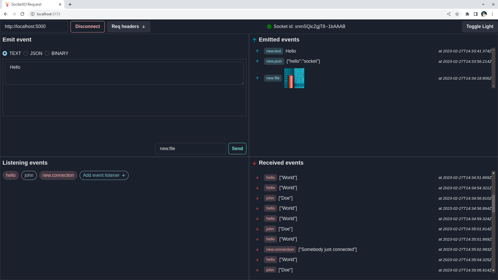

# SocketIO request

This web app allows users to easily test SocketIO server connections and messaging. SocketIO is a framework that enables
real-time, bidirectional communication between web clients and servers. The app utilizes the SocketIO client library to
connect to a user-specified SocketIO server and display connection status updates, as well as messages received from the
server.

## Main features

- Allow users to enter a URL to connect to a SocketIO server
- Display connection status and socket id
- Provide an input box to send test messages to the connected server in the form of "text", "json" or "image"
- Specify what events to listen, and see messages received from the server
- Users can temporarily pause an event from listening

## Installation & Setup

1. Clone this repository
   - `git clone https://github.com/minsoeaung/socketio-request.git`
2. In the project directory
   - run `npm install` to install dependencies and wait
3. Run `npm run dev` to start the application
4. Enjoy!
